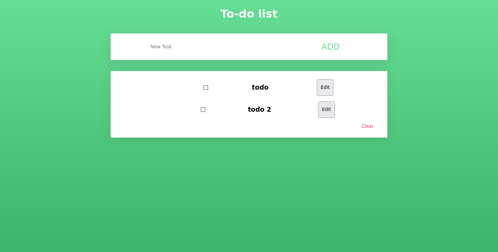

# MERN Todo app



A todo app using MongoDB, Node, React and Express.

## How to run

Clone the repo

```shell
cd backend
npm i
npm start
```
Create an `.env` file and add `PORT` (Default: 3001) and `MONGO_URI`.

```shell
cd frontend
npm i
npm start
```

Change the `url` const in `App.js` if you use a PORT that isn't 3001.